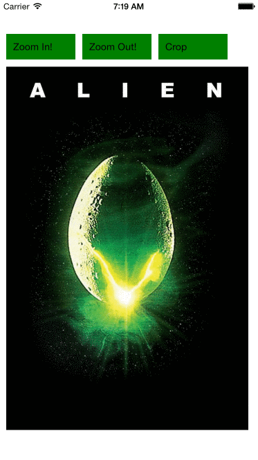

React Native Cropping Components
================================

This library provides two components `CroppingView` and `CroppedImage`
that allow you to crop views and to provide cropped images.

## Installation

```
npm install react-native-cropping --save
```

## Obligatory Demo



## CroppingView

Cropping view crops the child elements. It takes four props:

| Property   | Description                    |
| ---------- | ------------------------------ |
| `cropTop`  | The cropping top coordinate    |
| `cropLeft` | The cropping left coordinate   |
| `width`    | The width of the cropped area  |
| `height`   | The height of the cropped area |

The width of the `CroppingView` is the `width` plus the `cropLeft`. And
the height is the `height` put the `cropTop` value.

In the demo the size of `CroppingView` when cropped is this:


The can be animated as shown in the example using `AnimatedLayout`.

Here is a code sample:

```
<CroppingView
  cropTop={50}
  cropLeft={50}
  width={200}
  height={300}
  style={{
    borderRadius: 5
  }}>
  <Image
    source={require('image!alien')}
    style={{
      width: 350,
      height: 526
    }}
    resizeMode="contain" />
</CroppingView>
```

## CroppedImage

Cropped image crops an image. It takes these props:

| Property     | Description                    |
| ------------ | ------------------------------ |
| `cropTop`    | The cropping top coordinate    |
| `cropLeft`   | The cropping left coordinate   |
| `cropWidth`  | The width of the cropped area  |
| `cropHeight` | The height of the cropped area |
| `source`     | The source of the image        |
| `resizeMode` | The image resize mode          |
| `width`      | The image height               |
| `height`     | The image width                |

The resultant image is sized to the `cropWidth` and `cropHeight`.

In the example the image is sized to the cropping area.


Here is a pretty simple example:

```
<CroppedImage
  source={require('image!alien')}
  cropTop={110}
  cropLeft={75}
  cropWidth={190}
  cropHeight={250}
  width={350}
  height={526}
  resizeMode="contain" />
```

## Example Code

There is [some sample code provided](./example/animcrop.js).
